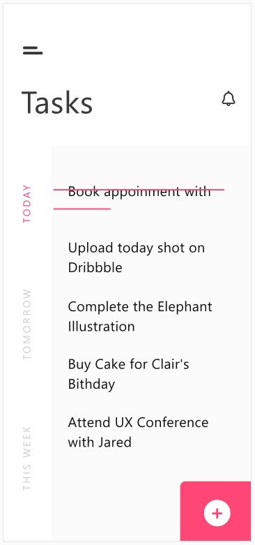

# Tasks App

We are creating a simple task app with [Storybook](https://storybook.js.org/) for HTML and CSS/SCSS. The design is based on this [XD Design](https://xd.adobe.com/view/b538709f-c03e-4bc6-8519-f3dc19773438-e06b/specs/). The design was created [by Anshul Dawar on XD Guru](https://www.xdguru.com/todo-task-app-xd-concept/)

## Getting Started

- Install dependencies with `npm install`.
- Run Storybook with `npm run storybook`.

## Tests

This repository validates your HTML, CSS/SCSS and JS code with [HTMLHint](https://htmlhint.com/), [stylelint](https://stylelint.io/) and [ESLint](https://eslint.org/). You can call `npm run test` and/or install editor extensions.

### VSCode extensions

- [HTMLHint extension](https://marketplace.visualstudio.com/items?itemName=ctf0.htmlhint)
- [stylelint extension](https://marketplace.visualstudio.com/items?itemName=stylelint.vscode-stylelint)
- [ESLint extension](https://marketplace.visualstudio.com/items?itemName=dbaeumer.vscode-eslint)
